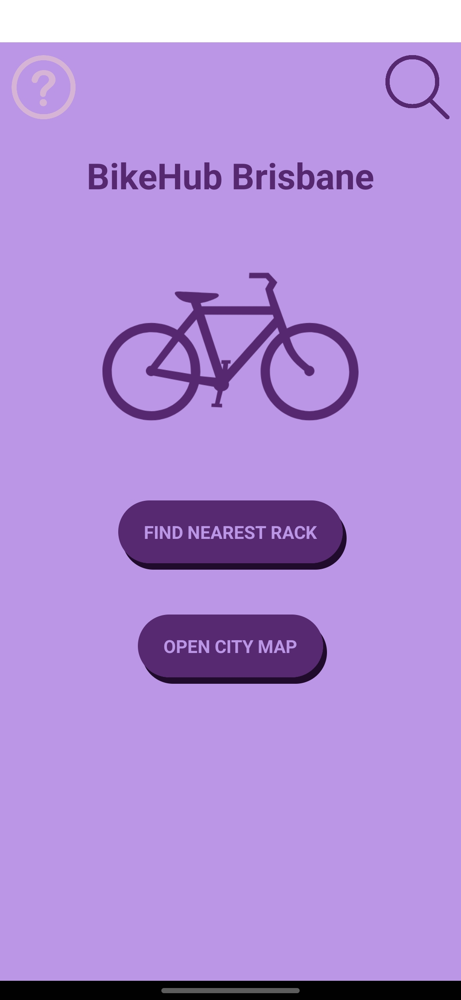
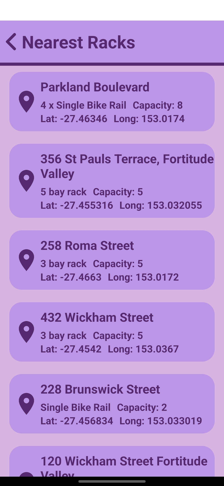
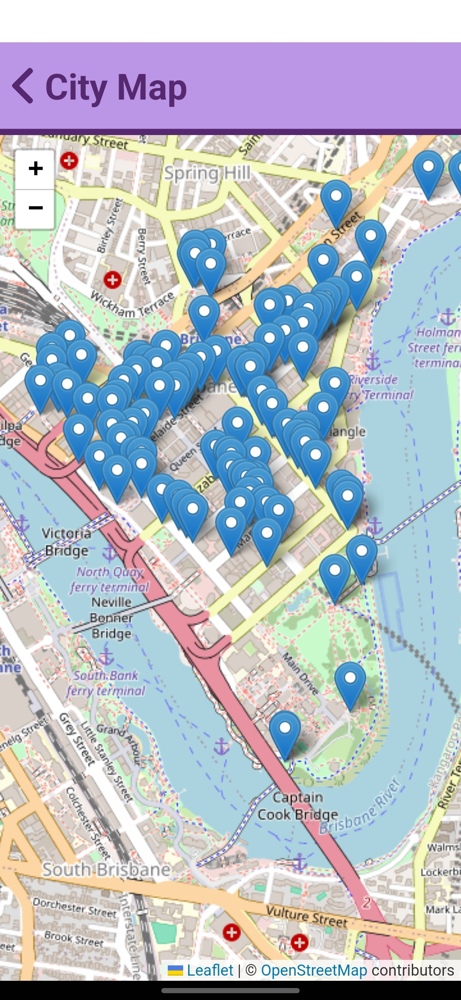
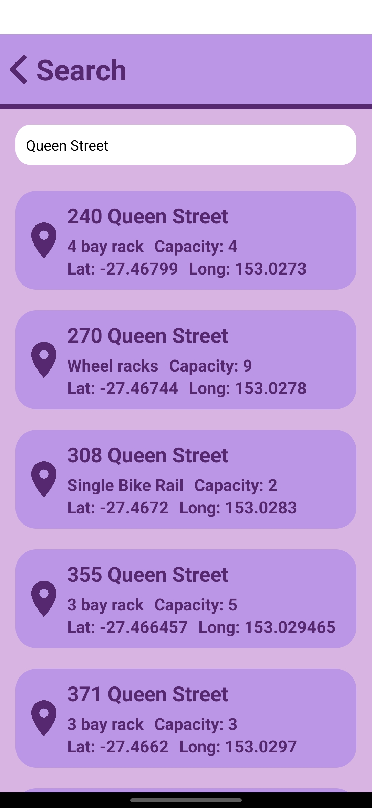

# BikeHub Brisbane App
A mobile app which helps cyclists and people with scooters find places to park. This app utilises the [Brisbane City Council Bicycle Rack API](https://data.brisbane.qld.gov.au/explore/dataset/bicycle-racks).

## Screenshots

## Instructions
For help on using the app click on the question mark icon in the top left of the home page.